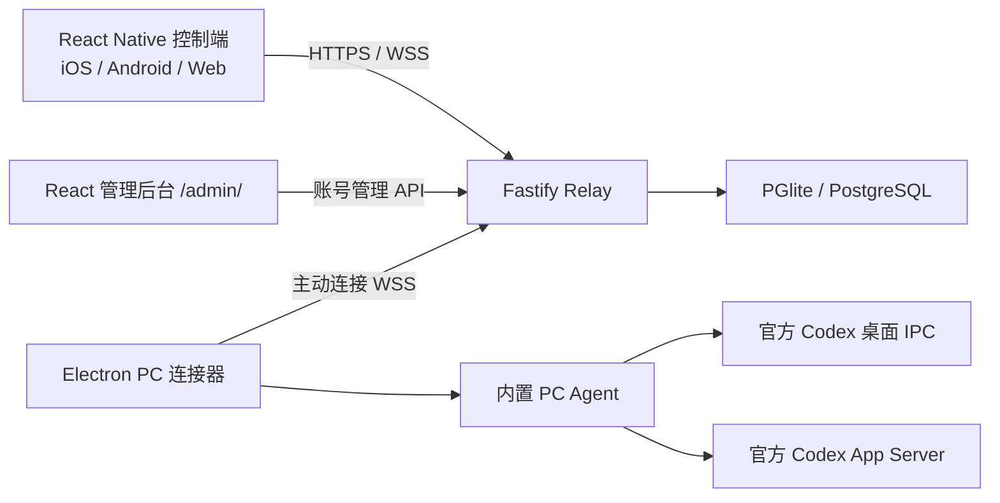

# 架构与功能分工

## 结构

控制端发出操作，Relay 校验账号、设备归属及命令时效后转发，PC Agent 在本机执行，再同步结果和会话状态。Codex 模型密钥、官方账号与执行环境留在本机；Relay 账号只负责项目的远程访问。

## 四个独立功能模块

| 模块 | 包含功能 | 不负责的功能 |
| --- | --- | --- |
| 控制端 | 登录、设备选择、项目/会话管理、消息、图片、队列、审批、模型/强度 | 创建用户、执行本机进程 |
| PC 连接器 | 登录、连接/断开/重连、设备配置、托盘、启动偏好、诊断；调用 Agent | 管理所有用户、作为远程聊天控制端 |
| 管理后台 | 创建账号、重置密码、禁用账号 | 会话列表、任务执行、跨账号访问电脑 |
| Relay | 账号认证、会话撤销、权限、设备状态、同步、命令/图片/历史转发、数据存储、静态页面 | 安装 PC 的 Codex、替用户运行模型任务 |

PC 连接器由主进程、隔离的 React 窗口、受限 preload、utilityProcess Agent 组成。网络与安全存储在主进程/Agent，窗口通过窄 IPC 操作；窗口不拥有 Node API、会话凭据或联网能力。

## 三种交付方案

1. 控制客户端：原生 App 使用 React Native，Web 使用同一代码的 Expo 导出。
2. PC 连接器：Electron 内置 Node，Agent 和依赖打进包；Windows 安装/便携，macOS DMG/ZIP。
3. 统一服务器：Relay 加两套独立前端静态产物，一个进程/端口。`/` 是控制端，`/admin/` 是 React 后台，`/v1/*` 是 API。

Admin 使用 React 而非 React Native：它面向浏览器管理员，与跨平台控制端职责不同。两者独立构建、独立 localStorage key；这不产生第二套控制逻辑。

## 代码地图

| 路径 | 用途 |
| --- | --- |
| `apps/mobile` | React Native 控制端，目录名称沿用现有工程 |
| `apps/web/dist` | 控制端的生成结果，不单独维护 UI |
| `apps/desktop` | Electron 主进程、preload、worker、React 控制台、打包配置 |
| `apps/pc-agent` | 本机运行时、状态扫描、命令和用量日志 |
| `apps/admin` | 独立账号管理网页 |
| `apps/relay` | Fastify API/WebSocket/静态服务及数据库 |
| `packages/protocol` | Zod 协议 schema、状态与命令类型 |
| `packages/codex-adapter` | 桌面 IPC、App Server、历史、模型、图片和程序发现 |
| `packages/client-shared` | 消息显示/历史合并/模型标签等控制端共用逻辑 |
| `packages/shared` | 账号、凭据、队列等基础代码 |
| `scripts` / `infra` | 开发、构建、安装、验收、运维 |
| `tests` / `docs` | 行为测试和功能文档 |

## 连接与任务边界

登录与远程连接是两种状态。登录成功默认连接；后续手动断开保留登录。退出账号清除本机加密会话并请求服务器撤销，不停止已开始的本机任务。

断开立即使旧 socket 回调失效、清除重连/心跳，拒绝新指令和尚未执行的 socket 队列，暂停待发送消息的自动启动。已交给 Codex 的操作不做撤回。重新连接保留 Agent epoch 与本机执行状态，恢复待发送队列。退出整个连接器停止 Agent 和其拥有的 App Server；有活动任务时先提示用户。

官方桌面 IPC 与 App Server 属于实验性兼容层。Windows 已有本机验证记录，macOS IPC 路径与官方版本兼容性需要实机确认，见 [macOS](mac.md)。
